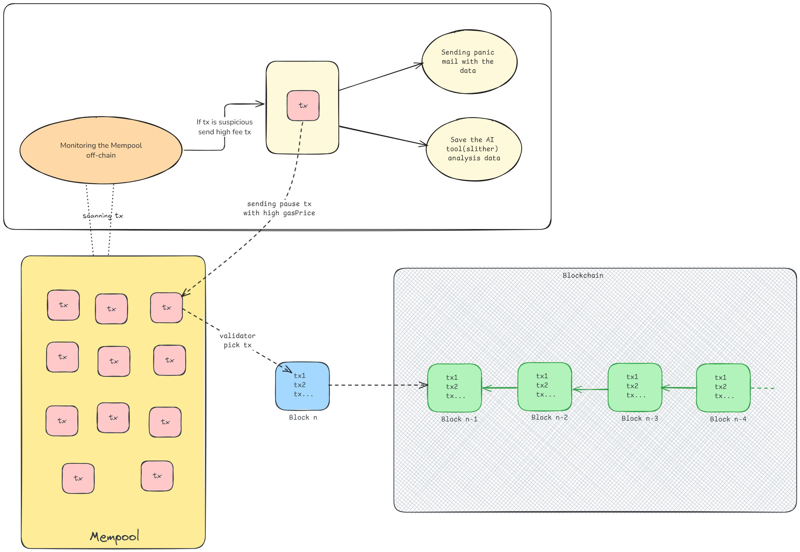
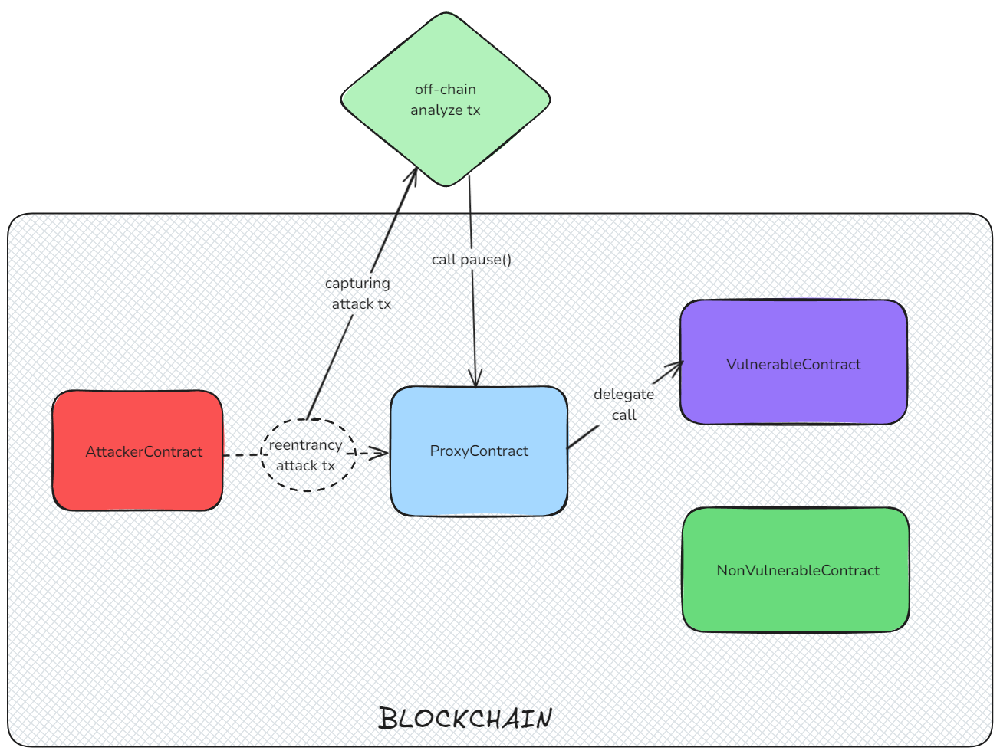
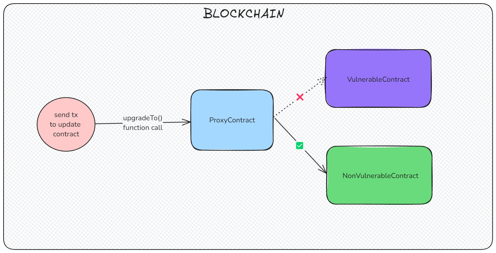

# AttackHunter: Smart Contract with Vulnerability and Exploit Detection

This project demonstrates an upgradeable smart contract with built-in vulnerability detection and prevention mechanisms. It showcases a comprehensive system that integrates both on-chain and off-chain components to safeguard the smart contract from attacks.


## Overview

This repository contains two main components:

1. **Off-Chain Simulation**: Off-chain microservices are responsible for detecting potential vulnerabilities in real-time. These services monitor Ethereum transactions, simulate outcomes, and trigger preventive actions such as sending notifications and running security analyses.
   
2. **Upgradeable Smart Contract**: Deployed using the UUPS (Universal Upgradeable Proxy Standard) pattern, this contract includes a deliberately introduced reentrancy vulnerability to simulate an attack scenario. It features a mechanism for upgrading the contract to fix vulnerabilities without affecting user data.
   

## Project Structure

```
AttackHunter/
│
├── upgradableContracts/   # Smart contract deployment
│   ├── contracts/
│   ├── scripts/
│   ├── test/
│   └── ...
│
└── simulation/            # Off-chain detection and prevention system
    ├── utils/
    ├── index.js
    └── ...

```

## Key Features:

- Upgradeable Contract: The smart contract uses the UUPS proxy pattern, allowing it to be upgraded after deployment, ensuring that vulnerabilities can be fixed without disrupting the user experience.

- Reentrancy Vulnerability: The project includes a vulnerable contract with a reentrancy issue, a secure contract that fixes the vulnerability, and an attacker contract that simulates the exploit.

- Off-Chain Monitoring: Off-chain microservices listen to blockchain events, simulate transactions, and detect potential attacks. When an attack is detected, notifications are sent, and security analyses are triggered.

## Setup

- [Upgradeable Smart Contract](https://github.com/ChitranshVashney/AttackHunter/blob/master/upgradableContracts/README.md)
- [Off-Chain Simulation](https://github.com/ChitranshVashney/AttackHunter/blob/master/simulation/README.md)
