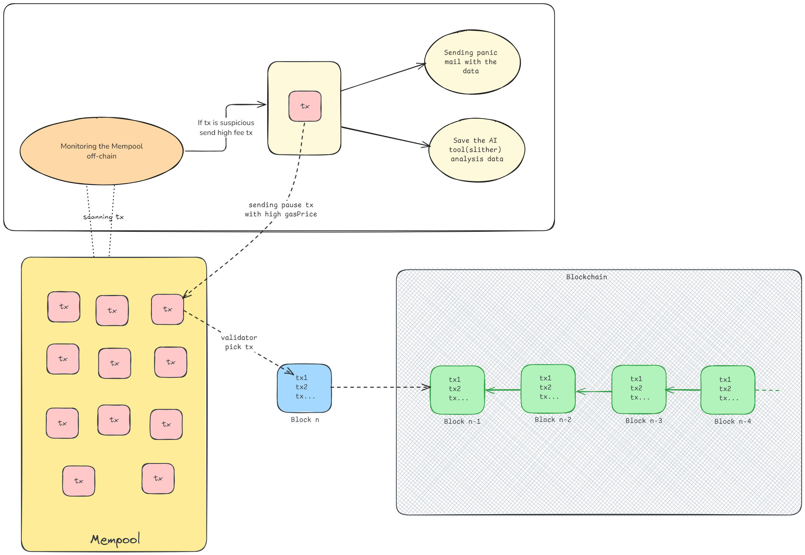

# Off-Chain Simulation Documentation

This section provides a comprehensive guide to the off-chain microservices responsible for monitoring and protecting smart contracts. These services interact with the Ethereum blockchain, simulate transactions, and respond to potential vulnerabilities or attacks. They are also responsible for reporting any suspicious activity and executing automated responses.

## Architecture Overview

The off-chain system architecture is designed to monitor blockchain transactions, simulate potential outcomes, and trigger preventive measures if any vulnerabilities are detected. The services are built using Node.js and rely on Alchemy's SDK to listen to blockchain events and interact with smart contracts. The system also includes email notifications and security analysis using Slither.


**Components:**

1. **Transaction Monitor**: Listens to pending Ethereum transactions using Alchemy’s WebSocket API.
1. **Transaction Simulation**: Simulates transactions to detect vulnerabilities before they are executed.
1. **Balance Checker**: Retrieves and checks Ethereum balances for suspicious activities.
1. **Email Notification**: Sends alerts if a vulnerability or attack is detected.
1. **Security Analysis**: Runs security checks using Slither, a static analysis tool for Solidity smart contracts.\

## Usage Guidelines

- Monitoring Transactions:
  The system listens to pending transactions using Alchemy’s WebSocket API. It extracts details such as sender, receiver, value, and input data, and then passes the transaction for further analysis.

```js
Copy code
alchemy.ws.on({
method: AlchemySubscription.PENDING_TRANSACTIONS,
}, (tx) => {
// Process transaction
});
```

- Transaction Simulation:
  Before executing a transaction, the system simulates it to predict changes on the blockchain. This helps identify vulnerabilities before they are exploited.

```js
Copy code
async function txSimulationasync(tx) {
// Simulate transaction
}
```

- Email Notification:
  If the system detects an attack, it triggers an email notification to alert the concerned parties.

```js
Copy code
async function sendNotificationEmail(tx, sim) {
// Send email alert
}
```

- Security Analysis with Slither:
  The system performs periodic security checks using Slither to analyze the smart contract code and generate reports.

```js
Copy code
async function runSlitherAnalysis() {
// Run Slither analysis
}
```

## Setup Instructions

1. Prerequisites:

- Node.js installed on your system.
- Alchemy API key for accessing Ethereum blockchain data.
- Gmail account for sending email notifications (ensure less secure apps access is enabled).
- Slither installed for Solidity analysis.

2. Installation:
   Begin by installing the required Node.js dependencies:

```
git clone https://github.com/ChitranshVashney/AttackHunter.git
cd AttackHunter/simulation
npm install
```

3. Environment Variables:
   Set up environment variables in a .env file:

```
API_PROVIDER="YourAlchemyAPIKey"
PRIVATE_KEY="YourPrivateKey"
PASS="YourGmailPassword"
```

4. Running the Service:
   To start monitoring transactions and executing the security functions, simply run the main script:

```
node index.js
```

## Example Workflow

1. **Transaction Detection**: The system detects a pending transaction and extracts its details.
1. **Simulation:** It simulates the transaction to foresee potential outcomes and vulnerabilities.
1. **Balance Check**: The system checks the contract’s balance to ensure that no unauthorized funds are being drained.
1. **Email Alert**: If any suspicious activity is detected, an email alert is sent immediately.
1. **Security Analysis**: The system runs a comprehensive analysis using Slither to detect vulnerabilities in the smart contract code.
