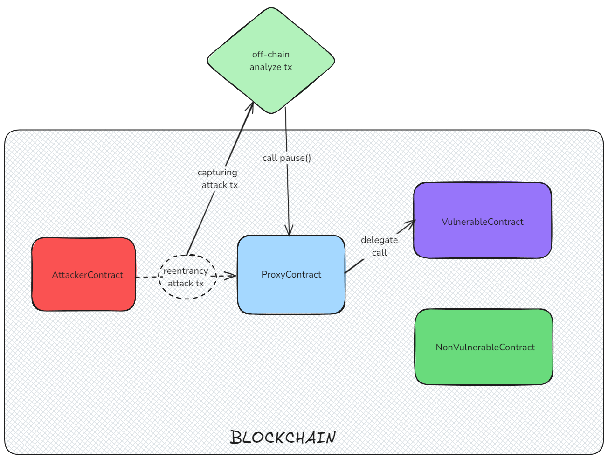

# Upgradeable Smart Contract with Vulnerability and Exploit Detection

## Overview


This project demonstrates an upgradeable smart contract that contains a known vulnerability (reentrancy). The contract is designed to be upgradeable using the UUPS (Universal Upgradeable Proxy Standard) pattern, allowing it to be upgraded after the detection of vulnerabilities. Additionally, a system of microservices is implemented to detect, prevent, and report exploitation attempts.

The demonstration includes:

- A **vulnerable contract** with a reentrancy vulnerability.
- A **secure contract** that fixes the vulnerability.
- An **attacker contract** designed to exploit the vulnerability.
- Deployment scripts that automate the setup and upgrade process.

## Smart Contracts

### 1. UUPS Proxy

The `UUPSProxy` contract acts as the entry point for all user interactions. It forwards calls to the current implementation (logic contract), allowing for upgrades without changing the proxy address. This pattern separates the storage and logic, which enables upgrading the logic without affecting user data.

```solidity
contract UUPSProxy is ERC1967Proxy {
    constructor(address _implementation, bytes memory _data)
        ERC1967Proxy(_implementation, _data) {}
}
```

### 2. VulnerableContract

This contract contains a reentrancy vulnerability in its withdraw function. Reentrancy occurs when a contract calls another contract (or itself) before updating its state, allowing the called contract to re-enter and drain funds.

- **Vulnerability**: The balance is updated after sending the funds, making it possible for an attacker to re-enter and drain the contract's funds.
- **Upgradeable**: The contract can be upgraded through the UUPS pattern, and it includes Ownable and Pausable functionalities for security control.

```solidity
function withdraw() public virtual whenNotPaused {
    require(balances[msg.sender] >= 0, "Insufficient balance");

    (bool success, ) = msg.sender.call{value: balances[msg.sender]}("");
    require(success, "Transfer failed");

    balances[msg.sender] = 0;
}
```

### 3. SecureContract

This contract inherits from VulnerableContract and fixes the reentrancy issue by following the checks-effects-interactions pattern:

- Checks: Ensure the balance is sufficient.
- Effects: Update the balance before making the external call.
- Interactions: Send the funds after updating the state to prevent reentrancy.

```solidity
function withdraw() public override whenNotPaused {
    require(balances[msg.sender] >= 0, "Insufficient balance");

    balances[msg.sender] = 0;

    (bool success, ) = msg.sender.call{value: balances[msg.sender]}("");
    require(success, "Transfer failed");
}
```

### 4. ReentrancyAttacker

This contract simulates an attack on the vulnerable contract. It deposits a small amount of Ether and then re-enters the contract through the `receive()` function, continuously draining funds.

```solidity
receive() external payable {
    if (address(vulnerableContract).balance > 0) {
        vulnerableContract.withdraw();
    }
}
```

## Deployment and Upgrades

### Initial Deployment

The deployment script deploys the VulnerableContract implementation and sets it as the target of the proxy. The vulnerable contract is then initialized via the proxy, allowing users to interact with it.

```solidity
function _deployInitialVersion() internal {
    vulnerableImpl = new VulnerableContract();
    proxy = new UUPSProxy(address(vulnerableImpl), "");
    address(proxy).call(abi.encodeWithSignature("initialize()"));
}
```

### Upgrading to Secure Implementation


After detecting the vulnerability, the contract can be upgraded to the SecureContract implementation by calling the upgradeTo function in the proxy. This switches the logic contract, fixing the vulnerability without affecting user balances or the contract address.

```solidity
function _upgradeImplementation() internal {
    secureImpl = new SecureContract();
    address(proxy).call(abi.encodeWithSignature("upgradeTo(address)", address(secureImpl)));
}
```

## Known Vulnerability: Reentrancy Attack

Reentrancy is a common attack in which an attacker repeatedly calls a function before the contract can update its state. This allows the attacker to drain the contract's funds by re-entering the `withdraw()` function before the balance is reset.

In this project, the vulnerability is deliberately introduced to simulate an attack scenario. The `ReentrancyAttacker` contract exploits this vulnerability, and the system is designed to detect and prevent such attacks through microservices and upgradeability.

## Setup Instructions

1. Clone the Repository
   Clone the project repository to your local machine.

```
git clone https://github.com/ChitranshVashney/AttackHunter.git
cd AttackHunter/upgradableContracts
```

2. Install Dependencies
   Ensure that you have the required dependencies installed, such as forge (from Foundry) and other relevant packages for contract deployment.

```
forge install
```

3. Test the Contracts
   Test the smart contracts to ensure everything is set up correctly.

```
forge test
```

4. Add `.env` required variable

```
SEPOLIA_RPC_URL=
PRIVATE_KEY=
ETHERSCAN_API_KEY=
```

5. Run the Deployment Script
   Deploy the contracts using the provided script.

```
forge script script/Deploy.s.sol --broadcast --verify --rpc-url YOUR_RPC_URL
```

6. Simulate the Attack
   After deployment, simulate the reentrancy attack by interacting with the ReentrancyAttacker contract.

7. Upgrade the Contract
   If the attack is detected, upgrade the contract to the secure version using the \_upgradeImplementation() function in the deployment script.

### Usage Guidelines

- Depositing Funds: Users can deposit funds into the contract by calling the deposit() function.
- Withdrawing Funds: Users can withdraw funds using the withdraw() function. However, the contract contains a reentrancy vulnerability, so this should only be done once the contract is upgraded to the secure version.
- Pausing/Unpausing: The contract owner can pause and unpause the contract to prevent further deposits or withdrawals.
- Upgrading: The contract owner can upgrade the contract to a secure version to fix vulnerabilities. This is crucial after detecting an exploit attempt.

//https://excalidraw.com/#json=3R9tUtpkAEaj8KCTDLUEX,eZEVhfLWPJpQSUCMMW1qhw
